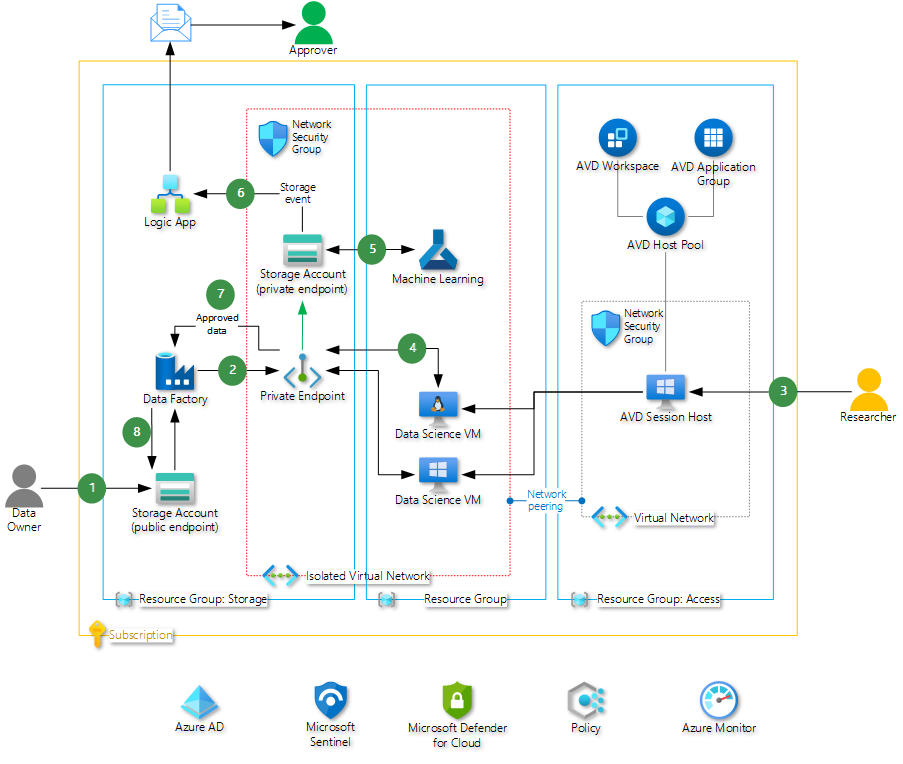

# The Azure Secure Enclave for Research

## What is the Azure Secure Enclave for Research?

The [**Secure Enclave for Research**](https://docs.microsoft.com/azure/architecture/example-scenario/ai/secure-compute-for-research) (also known as the Secure Research Enclave) is a reference architecture for a remotely-accessible environment for researchers to use in a secure manner while working on restricted data sets. The solution features robust mechanisms for control over user access to the environment and also over movement of data in or out of scope for analysis so it is ideal for working with restricted data sets. Data in the environment can be analyzed with traditional VMs using Windows or Linux with well-known tools such as R Studio and also supports the use of advanced analytical tools such as Azure Machine Learning.

The solution is built using multiple Azure services including [Azure Virtual Desktop](https://azure.microsoft.com/services/virtual-desktop/), Azure Key Vault, and Azure Data Factory to provide strong control over data movement into and out of the environment in order to prevent unauthorized exfiltraction of data sets.

This solution was created in collaboration with the University of Pittsburgh.

**Important:**  *The Azure Secure Enclave for Research is not a substitute for good security practices. It is only a set of tools and processes which help you maintain a secure environment. Please read this repo's Wiki for instructions on how the environment is intended to function and how to manage security for both users and data properly.*

## Deploying the Secure Enclave

This repository contains a set of Bicep templates which will deploy a complete SRE solution in a parameterized fashion. You can either download the Bicep templates and execute them using the *deploy.ps1* PowerShell script or simply use the "Deploy to Azure" button on this page.

To help you with the process of deploying research environments, refer to the ["Secure Research" Azure DevOps Generator](https://azuredevopsdemogenerator.azurewebsites.net/?name=secresearch) template. This Azure DevOps template contains Azure Boards work items to guide you through the design decisions and deployment of a complete research environment.

For complete documentation, please refer to the [Wiki](/wiki).

## Similar Projects

These projects may also be useful for groups which would like to get started working with sensitive data sets on Microsoft Azure.

- [Azure Trusted Research Environments (Azure TRE)](https://microsoft.github.io/AzureTRE)
- The [Mission Landing Zone](https://github.com/Azure/MissionLZ) project is a set of templates which deploy a complete "Landing Zone" in Azure following Microsoft's best practices for isolation and separation of data, services, and security controls. It is designed with a focus on SACA (SCCA) compliance in Azure Government.

## Contributing

See [Contributing](CONTRIBUTING.md)

## Trademarks

This project may contain trademarks or logos for projects, products, or services. Authorized use of Microsoft trademarks or logos is subject to and must follow [Microsoft's Trademark & Brand Guidelines](https://www.microsoft.com/legal/intellectualproperty/trademarks/usage/general). Use of Microsoft trademarks or logos in modified versions of this project must not cause confusion or imply Microsoft sponsorship. Any use of third-party trademarks or logos are subject to those third-party's policies.
